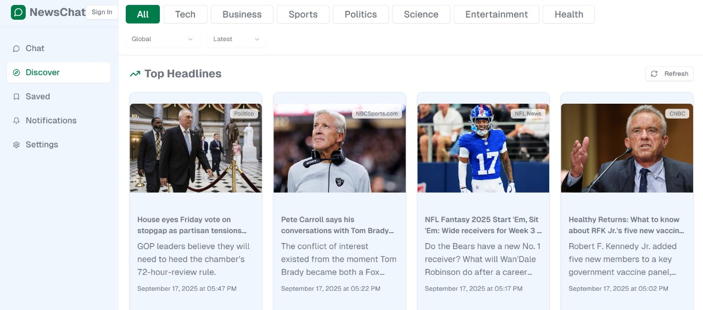

# NewsChat - AI-Powered News Assistant

A modern web application that combines real-time news with AI-powered chat assistance.

## Features

- 🤖 AI-powered chat with news context
- 📰 Real-time news fetching with date and location filtering
- 🌙 Dark/Light mode toggle
- 📱 Responsive design
- 🔍 Smart news categorization

## Local Development Setup

### 1. Download the Project
- Click the three dots (⋯) in the top right of the v0 interface
- Select "Download ZIP" to get the project files
- Extract the ZIP file to your desired location

### 2. Install Dependencies
\`\`\`bash
cd newschat-app
npm install
\`\`\`

### 3. Set Up Environment Variables
Create a `.env.local` file in the root directory and add:

\`\`\`env
# Required API Keys
NEWS_API_KEY=your_news_api_key_here
GEMINI_API_KEY=your_gemini_api_key_here

# Optional (for production)
NEXT_PUBLIC_BASE_URL=http://localhost:3000
\`\`\`

**Get your API keys:**
- **News API**: Sign up at [newsapi.org](https://newsapi.org) for a free API key
- **Gemini API**: Get your key from [Google AI Studio](https://aistudio.google.com/app/apikey)

> **Note**: You only need `GEMINI_API_KEY` - the app automatically handles the Google AI SDK integration internally.

### 4. Run the Development Server
\`\`\`bash
npm run dev
\`\`\`

### 5. Open in Browser
Navigate to `http://localhost:3000` to see your NewsChat application.

## Using the App

### Dark Mode Toggle
- Click the Settings icon in the sidebar
- Toggle the "Dark Mode" switch to switch between light and dark themes
- The theme preference is automatically saved

### Chat Features
- Ask for news: "What's the latest news?"
- Specific dates: "News from yesterday" or "News from 5 Sept 2025"
- Location-based: "News from Bangalore" or "UK news"
- Categories: "Technology news" or "Sports headlines"

### News Features
- Browse categorized news articles
- Get AI-powered summaries
- Filter by date and location
- Real-time updates with daily refresh

## Requirements

- Node.js 18+ 
- Valid News API key
- Valid Gemini API key

## Deployment

The app is ready for deployment on Vercel or any Next.js-compatible platform. Make sure to add your environment variables in the deployment settings.
